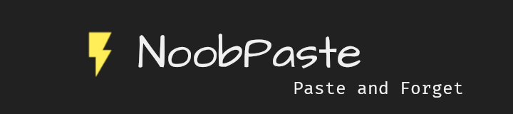

[](https://twitter.com/noobscience1)
[](https://newtoallofthis123.github.io/license)

# NoobPaste

NoobPaste is a simple and efficient pastebin alternative. It is just easy, secure and feature rich. It is written in python using the flask module. It is very secure and is hosted on [heroku](https://heroku.com) which is know as being quite secure. So rest assure and write.

<button style="padding: 12px; border-radius: 24px; background-color: #FF0000;"><a style="color: #f0f0f0; text-decoration: none; font-size: 18px;" href="https://noobpaste.herokuapp.com/blog/help_me">I Need help</a></button>

<button style="padding: 12px; border-radius: 24px; background-color: #212121;"><a style="color: #f0f0f0; text-decoration: none; font-size: 18px;" href="https://noobpaste.herokuapp.com/blog/help_me">Visit The Website</a></button>

# Features

1. *Secure*: NoobPaste is secure and uses a secure postgres database hosted on heroku

2. *Easy To Use*: NoobPaste is extremely Easy to use and quite understandable for beginners

3. *Editor*: NoobPaste comes built in with a beautiful customizable editor powered by [CodeMirror](https://codemirror.net).

4. *Rich Text*: NoobPaste supports Word like Rich Text and it is quite powerful.

5. *Open Source*: NoobPaste is completely open source with it's development active on github

6. *Password Protection:* NoobPaste offered password protection for Pastes

7. *API*: NoobPaste offers a No Sign Up API and it is quite powerful and accessisable.

8. *Self hostable:* Yes You can be easily hosted on heroku. Just Fork the repository and just replace all instances of "noobpaste" with your app name.

# About

Sharing Code has never been easier and more simpler then this. NoobPaste posts your data onto a secure database and it is very secure and easy to use. NoobPaste uses simple point one to point two redirect. This means not much javascript is used. NoobPaste uses [CodeMirror](https://codemirror.net) for syntax highlighting and uses it's CDN for fast delivery. NoobPaste is open source and it's development is active on [GitHub](https://github.com/newtoallofthis123/NoobPaste). You can sign in to NoobPaste to unlock some extra features but this is completely private.

# API

NoobPaste has an quite powerful post and get api. Examples on python are given below

## Post API

```python
#POST API

import requests
import json

url = 'https://noobpaste.herokuapp.com'

params={'title': 'title', 'paste_content': 'paste_content', 'author': 'author', 'lang': 'python', 'password': 'None'}
data = requests.post(f'{url}/post', params=params).content
json_data = json.loads(data)
print(json_data)
```

## Get API

```python
#get API

data = requests.get(f'{url}/api/<hash>/<password>'
json_data = json.loads(data)
print(json_data)
```

# Contribute

I need your help to make NoobPaste more secure and most importantly <mark>private</mark> .

You can [contact](mailto:noobscience123@gmail.com) me privately or just fork the project and send me a pull request. You contribution is important and please help me with this issue

<button style="padding: 12px; border-radius: 24px; background-color: #212121;"><a href="https://noobpaste.herokuapp.com/blog/help_me" style="color: #f0f0f0; text-decoration: none; font-size: 18px;">I Need help</a></button>

# License

## The MIT License (MIT)

Copyright © 2022 NoobScience

Permission is hereby granted, free of charge, to any person obtaining a copy
 of this software and associated documentation files (the “Software”), to deal
 in the Software without restriction, including without limitation the rights
 to use, copy, modify, merge, publish, distribute, sublicense, and/or sell
 copies of the Software, and to permit persons to whom the Software is
 furnished to do so, subject to the following conditions:

The above copyright notice and this permission notice shall be included in
 all copies or substantial portions of the Software.

THE SOFTWARE IS PROVIDED “AS IS”, WITHOUT WARRANTY OF ANY KIND, EXPRESS OR
 IMPLIED, INCLUDING BUT NOT LIMITED TO THE WARRANTIES OF MERCHANTABILITY,
 FITNESS FOR A PARTICULAR PURPOSE AND NONINFRINGEMENT. IN NO EVENT SHALL THE
 AUTHORS OR COPYRIGHT HOLDERS BE LIABLE FOR ANY CLAIM, DAMAGES OR OTHER
 LIABILITY, WHETHER IN AN ACTION OF CONTRACT, TORT OR OTHERWISE, ARISING FROM,
 OUT OF OR IN CONNECTION WITH THE SOFTWARE OR THE USE OR OTHER DEALINGS IN
 THE SOFTWARE.
